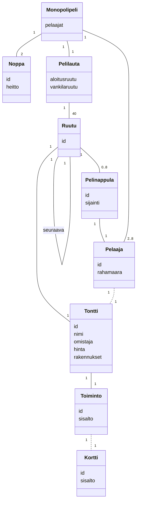

## Monopoli

```mermaid
 classDiagram
    Monopolipeli "1" -- "2" Noppa
    Monopolipeli "1" -- "1" Pelilauta
    Pelilauta "1" -- "40" Ruutu
    Ruutu "1" -- "1" Ruutu : seuraava
    Ruutu  "1" -- "1" Tontti
    Tontti "1" -- "1" Toiminto
    Toiminto "1" .. "1" Kortti
    Ruutu "1" -- "0..8" Pelinappula
    Pelinappula "1" -- "1" Pelaaja
    Pelaaja "1" .. "1" Tontti
    Pelaaja "2..8" -- "1" Monopolipeli
    
    class Monopolipeli {
        pelaajat 
    }
    class Ruutu {
        id
    }
    class Kortti {
        id
        sisalto
    }
    class Pelaaja {
        id
        rahamaara
    }
    class Pelinappula {
        id
        sijainti
    }
    class Noppa {
        id
        heitto
    }
    class Pelilauta {
        aloitusruutu
        vankilaruutu
    }
    class Tontti {
        id
        nimi 
        omistaja
        hinta
        rakennukset
    }
    class Toiminto {
        id
        sisalto
    }

```